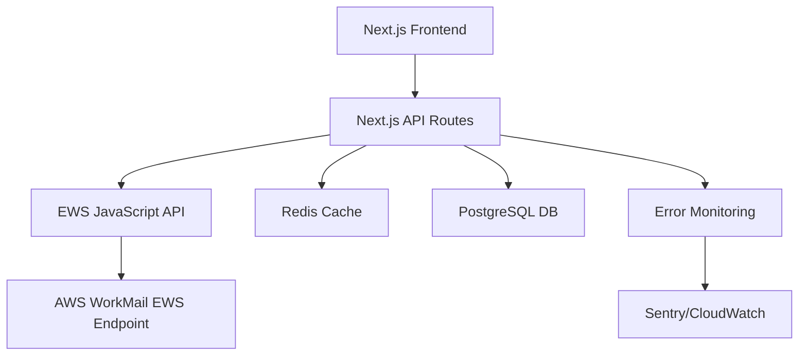
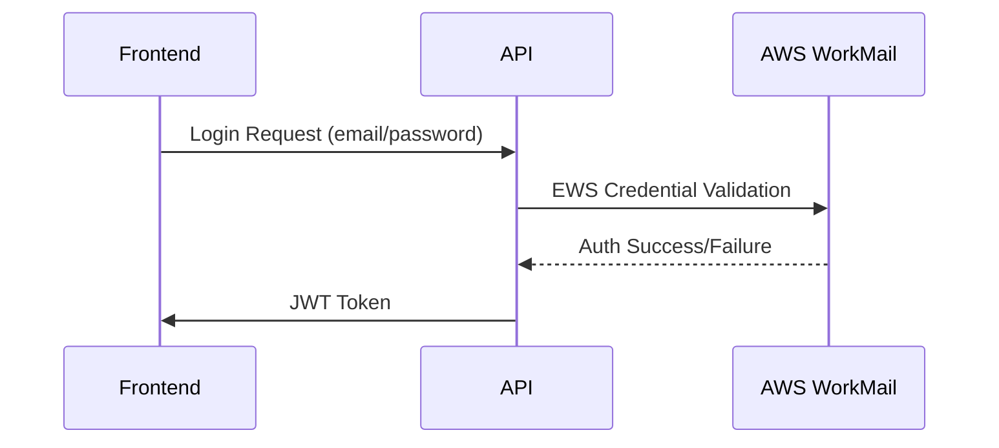
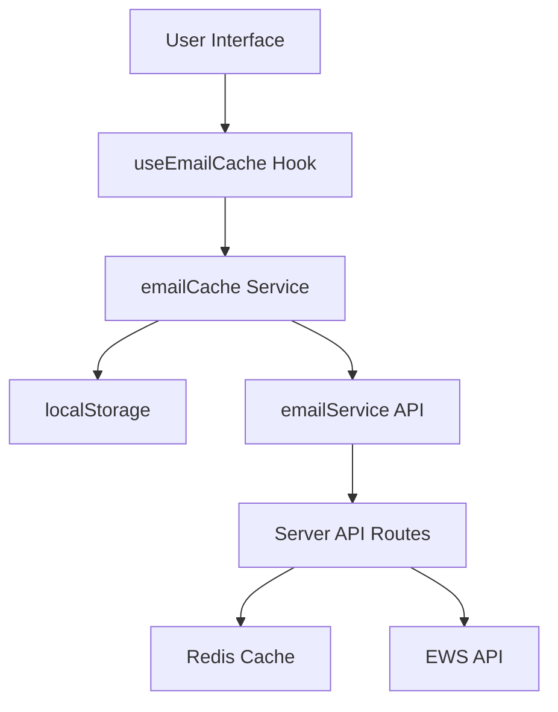

# Comprehensive Technical Specification: Email & Calendar Integration for AWS WorkMail using EWS JavaScript API

## 1. Overview

### Objective
Build a secure, scalable email and calendar management system integrated with AWS WorkMail using Exchange Web Services (EWS) JavaScript API, supporting:

- Email management (send/receive/organize)
- Calendar event management (create/update/delete)
- Contact synchronization
- Real-time notifications

### Current Implementation
- Existing login functionality remains unchanged
- Login credentials use format: `username@weroofamerica.com`
- Default password: `RestoreMastersLLC2024`
- Note: While login uses `@restoremastersllc.com` domain (e.g., j.black@restoremastersllc.com), the actual WorkMail domain is `@weroofamerica.com`

## 2. System Architecture



### Key Components
- **Frontend**: React-based UI with Next.js
- **Backend**: Next.js API routes (serverless functions)
- **EWS Client**: ews-javascript-api library
- **Caching**: Redis for frequent requests
- **Database**: PostgreSQL for user preferences
- **Auth**: AWS WorkMail email/password
- **Deployment**: Vercel

## 3. Email Module Specification

### Features

| Feature | EWS Method | API Route |
|---------|------------|-----------|
| List Emails | FindItems | GET /api/emails |
| Send Email | CreateItem | POST /api/emails |
| Move Email | MoveItem | PUT /api/emails/move |
| Delete Email | DeleteItem | DELETE /api/emails |
| Search Emails | SearchMailboxes | POST /api/emails/search |

### Example Implementation

```typescript
// app/api/emails/route.ts
import { ExchangeService, WebCredentials, Uri, WellKnownFolderName, ItemView } from 'ews-javascript-api';
import { NextResponse } from 'next/server';

export async function GET() {
  try {
    const service = new ExchangeService();
    service.Credentials = new WebCredentials(
      process.env.WORKMAIL_EMAIL,
      process.env.WORKMAIL_PASSWORD
    );
    service.Url = new Uri(process.env.EWS_ENDPOINT);
    
    const inbox = await service.FindItems(
      WellKnownFolderName.Inbox,
      new ItemView(50) // Get first 50 emails
    );
    
    const emails = inbox.Items.map(email => ({
      id: email.Id.UniqueId,
      subject: email.Subject,
      from: email.From.Address,
      received: email.DateTimeReceived.toISOString()
    }));
    
    return NextResponse.json({ emails });
  } catch (error) {
    console.error('Failed to fetch emails:', error);
    return NextResponse.json({ error: 'Failed to fetch emails' }, { status: 500 });
  }
}
```

## 4. Calendar Module Specification

### Features

| Feature | EWS Method | API Route |
|---------|------------|-----------|
| Create Event | CreateItem | POST /api/events |
| Update Event | UpdateItem | PUT /api/events/:id |
| Delete Event | DeleteItem | DELETE /api/events/:id |
| List Events | FindAppointments | GET /api/events |
| Handle Attendees | Add/Remove Attendees | POST /api/events/:id/invite |

### Event Schema

```typescript
interface CalendarEvent {
  id?: string;
  subject: string;
  start: string; // ISO 8601
  end: string;
  location?: string;
  body?: string;
  isAllDay?: boolean;
  attendees?: {
    email: string;
    name?: string;
    required?: boolean;
  }[];
  recurrence?: {
    pattern: 'Daily' | 'Weekly' | 'Monthly';
    interval: number;
    endDate?: string;
  };
}
```

## 5. Contacts Module Specification

### Features

| Feature | EWS Method | API Route |
|---------|------------|-----------|
| Create Contact | CreateContact | POST /api/contacts |
| Update Contact | UpdateItem | PUT /api/contacts/:id |
| Delete Contact | DeleteItem | DELETE /api/contacts/:id |
| List Contacts | FindContacts | GET /api/contacts |
| Search Contacts | ResolveName | GET /api/contacts/search |

### Contact Schema

```typescript
interface Contact {
  id?: string;
  displayName: string;
  emailAddress: string;
  businessPhone?: string;
  mobilePhone?: string;
  jobTitle?: string;
  company?: string;
  department?: string;
  notes?: string;
}
```

## 6. Security Implementation

### Authentication Flow



### Security Measures
- **Credential Storage**: Environment variables in Vercel
- **Rate Limiting**: 100 requests/minute per user
- **Input Validation**: Zod schema validation
- **HTTPS**: Enforce TLS 1.3
- **CORS**: Strict origin policy
- **JWT**: For session management

## 7. Error Handling Strategy

### Error Codes

| Code | Meaning | Recovery Action |
|------|---------|----------------|
| 429 | Rate limit exceeded | Retry after 60 seconds |
| 503 | EWS service unavailable | Check AWS Health Dashboard |
| 400 | Invalid request | Validate request body |

### Logging

```typescript
// lib/logger.ts
export const logEWSError = (error: Error) => {
  console.error(`[EWS Error] ${new Date().toISOString()}`, {
    message: error.message,
    stack: error.stack,
    correlationId: crypto.randomUUID()
  });
  
  // If using Sentry
  // Sentry.captureException(error);
};
```

## 8. Performance Optimization

### Caching Strategy

```typescript
// lib/cache.ts
import { Redis } from '@upstash/redis';

const redis = new Redis({
  url: process.env.REDIS_URL,
  token: process.env.REDIS_TOKEN,
});

export const getCachedEmails = async (userId: string) => {
  const cacheKey = `emails:${userId}`;
  const cached = await redis.get(cacheKey);
  
  if (cached) return JSON.parse(cached);
  
  const emails = await fetchEmailsFromEWS(userId);
  await redis.set(cacheKey, JSON.stringify(emails), { ex: 300 }); // 5m cache
  return emails;
};
```

### Batch Operations

```typescript
// lib/calendar.ts
export const batchCreateEvents = async (events: CalendarEvent[]) => {
  const service = initEWSService();
  const batch = service.CreateBatchRequest();
  
  events.forEach(event => {
    const ewsEvent = new CalendarEvent(service);
    ewsEvent.Subject = event.subject;
    ewsEvent.Start = new DateTime(event.start);
    ewsEvent.End = new DateTime(event.end);
    batch.AddCreateItemOperation(ewsEvent);
  });
  
  return batch.Execute();
};
```

## 9. Client-Side Caching Implementation

### Overview

The application implements a comprehensive client-side caching system to improve performance and reduce API calls. This system works in conjunction with the server-side Redis caching to provide a seamless user experience with real-time updates.

### Key Features

- User-specific caching linked to authenticated user
- Persistent storage using localStorage
- Automatic synchronization with server
- Cache freshness tracking
- Support for email list and detail caching

### Architecture



### Client-Side Cache Implementation

```typescript
// app/dashboard/email/services/emailCache.ts
interface EmailCache {
  [folder: string]: {
    emails: Email[];
    timestamp: number;
    total: number;
    page: number;
    pageSize: number;
  };
}

interface EmailDetailCache {
  [id: string]: {
    email: Email;
    timestamp: number;
  };
}

// Initialize cache for a specific user
export function initializeCache(userEmail: string): void {
  currentUser = userEmail;
  
  // Try to load from localStorage
  try {
    const storedEmailCache = localStorage.getItem(`emailCache_${userEmail}`);
    const storedDetailCache = localStorage.getItem(`emailDetailCache_${userEmail}`);
    
    if (storedEmailCache) {
      emailCache = JSON.parse(storedEmailCache);
    }
    
    if (storedDetailCache) {
      emailDetailCache = JSON.parse(storedDetailCache);
    }
  } catch (error) {
    // If there's an error, use empty caches
    emailCache = {};
    emailDetailCache = {};
  }
}
```

### Synchronization Mechanism

```typescript
// Check for new emails and update cache if needed
export async function checkForNewEmails(
  folder: 'inbox' | 'sent' | 'draft' | 'trash' | 'spam'
): Promise<{
  hasNewEmails: boolean;
  newCount: number;
}> {
  // Fetch just the first page with a small page size to check for new emails
  const result = await fetchEmails(folder, 1, 10, undefined, true);
  
  // Check if there are new emails by comparing IDs
  const cachedIds = new Set(emailCache[folder].emails.map(email => email.id));
  const newEmails = result.emails.filter(email => !cachedIds.has(email.id));
  
  if (newEmails.length > 0) {
    // Add new emails to the beginning of the cache
    emailCache[folder].emails = [...newEmails, ...emailCache[folder].emails];
    emailCache[folder].timestamp = Date.now();
    emailCache[folder].total = emailCache[folder].total + newEmails.length;
    
    // Save to localStorage
    saveCache();
    
    return { hasNewEmails: true, newCount: newEmails.length };
  }
  
  return { hasNewEmails: false, newCount: 0 };
}
```

### React Hook Integration

```typescript
// app/dashboard/email/services/useEmailCache.ts
export function useEmailCache({
  folder,
  page = 1,
  pageSize = 50,
  initialLoad = true,
  syncInterval = 60000 // Default to checking every minute
}: UseEmailCacheProps): UseEmailCacheResult {
  const { data: session } = useSession();
  const [emails, setEmails] = useState<Email[]>([]);
  const [hasNewEmails, setHasNewEmails] = useState<boolean>(false);
  const [newEmailsCount, setNewEmailsCount] = useState<number>(0);
  
  // Initialize cache when session is available
  useEffect(() => {
    if (session?.user?.email) {
      initializeCache(session.user.email);
    }
  }, [session]);

  // Set up interval to check for new emails
  useEffect(() => {
    if (!syncInterval || !session?.user?.email) {
      return;
    }
    
    const intervalId = setInterval(checkNewEmails, syncInterval);
    
    return () => {
      clearInterval(intervalId);
    };
  }, [checkNewEmails, session?.user?.email, syncInterval]);
  
  // Other implementation details...
}
```

### API Integration

The server-side API routes have been enhanced to support the client-side caching system:

```typescript
// app/api/emails/route.ts
export async function GET(request: NextRequest) {
  // Parse query parameters
  const searchParams = request.nextUrl.searchParams;
  const sync = searchParams.get('sync') === 'true';
  
  // If sync is true, bypass cache and fetch fresh data
  const shouldUseCache = !sync && await isEmailCacheFresh(userId, folder, 60);
  
  if (shouldUseCache) {
    const cachedEmails = await getCachedEmails(userId, folder);
    
    if (cachedEmails) {
      return NextResponse.json({
        emails: cachedEmails,
        fromCache: true,
        lastSynced: Date.now(),
      });
    }
  }
  
  // Fetch from EWS and update cache
  // ...
}
```

### Benefits

1. **Reduced API Calls**: Minimizes the number of requests to the server
2. **Improved Performance**: Faster loading times for email lists and details
3. **Offline Capabilities**: Basic functionality when offline (viewing cached emails)
4. **Real-time Updates**: Periodic checking for new emails
5. **User-specific**: Each user has their own isolated cache
6. **Persistent**: Cache survives page refreshes via localStorage

### Cache Invalidation

The system implements several cache invalidation strategies:

1. **Time-based expiration**: Cache entries expire after a configurable time
2. **Manual refresh**: Users can force a refresh
3. **Action-based invalidation**: Cache is updated after actions like moving or deleting emails
4. **Periodic synchronization**: Regular checks for new emails

## 10. Deployment Strategy (Vercel)

### Vercel Configuration

```json
// vercel.json
{
  "buildCommand": "npm run build",
  "devCommand": "npm run dev",
  "outputDirectory": ".next",
  "framework": "nextjs",
  "regions": ["iad1"],
  "headers": [
    {
      "source": "/api/(.*)",
      "headers": [
        { "key": "Cache-Control", "value": "no-store" }
      ]
    }
  ]
}
```

### Environment Variables (Vercel)

- `WORKMAIL_EMAIL` - WorkMail admin email
- `WORKMAIL_PASSWORD` - WorkMail admin password
- `EWS_ENDPOINT` - WorkMail EWS endpoint (typically https://outlook.awsapps.com/EWS/Exchange.asmx)
- `JWT_SECRET` - Secret for JWT token signing
- `REDIS_URL` - Redis connection URL (Upstash)
- `REDIS_TOKEN` - Redis authentication token (Upstash)

## 11. Testing Plan

### Test Types
- **Unit Tests**: Jest tests for business logic
- **Integration Tests**: EWS mock server testing
- **E2E Testing**: Cypress for UI workflows

### EWS Mock Server

```javascript
// tests/mocks/ews-server.js
const express = require('express');
const bodyParser = require('body-parser');
const app = express();

app.use(bodyParser.text({ type: 'text/xml' }));

app.post('/EWS/Exchange.asmx', (req, res) => {
  if (req.body.includes('FindFolder')) {
    res.type('application/xml');
    res.send(mockInboxResponse);
  }
});

const mockInboxResponse = `
<soap:Envelope>
  <soap:Body>
    <m:FindItemResponse>
      <m:ResponseMessages>
        <m:FindItemResponseMessage ResponseClass="Success">
          <m:Items>
            <t:Message>
              <t:ItemId Id="AAMkAGNiY2YxMjM4LTUwZDYtNDZiZi1iNGRmLTMxMmQzMGZmZDE1ZQBGAAAAAAA=" />
              <t:Subject>Test Email</t:Subject>
              <t:DateTimeReceived>2023-10-20T12:34:56Z</t:DateTimeReceived>
            </t:Message>
          </m:Items>
        </m:FindItemResponseMessage>
      </m:ResponseMessages>
    </m:FindItemResponse>
  </soap:Body>
</soap:Envelope>
`;

app.listen(8080, () => console.log('Mock EWS server running on port 8080'));
```

## 12. Dependencies

```json
{
  "dependencies": {
    "next": "^14.0.0",
    "react": "^18.2.0",
    "react-dom": "^18.2.0",
    "ews-javascript-api": "^0.12.0",
    "@upstash/redis": "^1.22.0",
    "zod": "^3.22.4",
    "next-auth": "^4.24.5",
    "jose": "^5.1.1"
  },
  "devDependencies": {
    "typescript": "^5.2.2",
    "jest": "^29.7.0",
    "cypress": "^13.3.0",
    "@types/node": "^20.8.0",
    "@types/react": "^18.2.25"
  }
}
```

## 13. Timeline & Milestones

| Phase | Duration | Deliverables |
|-------|----------|--------------|
| Setup | 1 week | Project structure, authentication |
| Email Module | 2 weeks | Email API endpoints, UI components |
| Calendar Module | 2 weeks | Calendar API endpoints, UI components |
| Contacts Module | 1 week | Contacts API endpoints, UI components |
| Testing | 1 week | Unit tests, integration tests |
| Deployment | 1 week | Vercel deployment, monitoring |

## 14. AWS WorkMail Considerations

### WorkMail Limits
- **EWS requests**: 30 req/sec (implement rate limiting)
- **Attachment size**: 30MB (validate before upload)
- **Mailbox size**: 50GB per user (monitor usage)

### WorkMail EWS Support
- AWS WorkMail supports Exchange Web Services (EWS) API
- Uses standard EWS SOAP XML format
- Authentication via Basic Auth (username/password)
- Supports Exchange 2010 SP2 protocol version

### WorkMail EWS Limitations and Workarounds
- **Missing Sender Information**: AWS WorkMail's EWS implementation often returns `null` for the `From` property in emails. This requires implementing custom workarounds:
  - Use the `GetItem` operation (via `EmailMessage.Bind` in the EWS JavaScript API) to retrieve more detailed email information
  - Extract sender information from MIME content when available
  - Try to parse sender information from email subject lines when possible
  - Use placeholder sender information as a last resort
  - For UI display, handle cases where sender information is missing
- **Limited Properties**: Some standard Exchange properties may not be available or may behave differently in AWS WorkMail
  - Use `BasePropertySet.FirstClassProperties` to ensure maximum property retrieval
  - Implement fallbacks for critical properties that might be missing
- **Performance Considerations**: 
  - Implement caching to reduce API calls due to these limitations
  - Use batch operations where possible to minimize API calls
  - Consider pagination for large mailboxes to improve performance

### WorkMail Folder Structure
AWS WorkMail provides the following standard folders:

| Folder Name | Description |
|-------------|-------------|
| Inbox | Main folder for received emails |
| Outbox | Temporary storage for emails being sent |
| Deleted Items | Trash folder for deleted emails |
| Sent Items | Folder containing sent emails |
| Drafts | Folder for email drafts |
| Journal | System folder for journal entries |
| Notes | System folder for notes |
| Junk E-mail | Folder for spam/junk emails |
| RSS Feeds | Folder for RSS subscriptions |
| Conversation Action Settings | System folder for conversation settings |
| Quick Step Settings | System folder for quick step settings |
| Sent Mail | Alternative folder for sent emails (Gmail compatibility) |
| All Mail | Folder containing all emails (Gmail compatibility) |
| Starred | Folder for starred/flagged emails (Gmail compatibility) |
| Important | Folder for important emails (Gmail compatibility) |
| Contacts | Folder containing contact items |
| Suggested Contacts | System folder for suggested contacts |
| Calendar | Folder containing calendar events |
| Tasks | Folder containing task items |

Note: Some folders like "Sent Mail", "All Mail", "Starred", and "Important" are specific to AWS WorkMail's Gmail compatibility mode.

## 15. UI Components (Overview)

### Email UI Components
- Inbox view with filtering/sorting
- Email detail view with HTML rendering
- Compose/reply interface with rich text editor
- Folder navigation and management

### Calendar UI Components
- Month, week, day views
- Event creation/editing modal
- Recurring event configuration
- Invitee management interface

### Contacts UI Components
- Contact list with search/filter
- Contact detail/edit views
- Contact groups management
- Import/export functionality

## 16. Email Attachments Implementation

### Attachment Handling with AWS WorkMail

Based on extensive testing, we've identified specific requirements for handling attachments with AWS WorkMail using the EWS JavaScript API:

#### File Attachments
For sending emails with file attachments, use the following approach:

```typescript
// lib/email-attachments.ts
export const sendEmailWithAttachments = async (
  to: string[],
  subject: string,
  body: string,
  attachments: Array<{name: string, content: Buffer, contentType: string}>
) => {
  const service = await initEWSService();
  
  // 1. Create the message
  const message = new EmailMessage(service);
  message.Subject = subject;
  message.Body = new MessageBody(body);
  to.forEach(recipient => message.ToRecipients.Add(new EmailAddress(recipient)));
  
  // 2. Save the message as draft first
  await message.Save();
  
  // 3. Add attachments to the saved message
  for (const attachment of attachments) {
    const fileAttachment = message.Attachments.AddFileAttachment(
      attachment.name, 
      attachment.content
    );
    fileAttachment.ContentType = attachment.contentType;
  }
  
  // 4. Update the message with attachments
  await message.Update(ConflictResolutionMode.AlwaysOverwrite);
  
  // 5. Send the message
  await message.Send();
  
  return message.Id?.UniqueId;
};
```

#### Attachment Limitations
- **Inline Attachments**: AWS WorkMail has limited support for inline attachments through EWS
- **Item Attachments**: Attaching other emails as attachments is problematic with AWS WorkMail
- **Attachment Size**: Maximum attachment size is 30MB
- **Content Types**: Always specify the content type for attachments

### Implementation in sendEmail Function

```typescript
// Updated sendEmail function in lib/ews.ts
export const sendEmail = async (
  to: string[],
  subject: string,
  body: string,
  cc?: string[],
  bcc?: string[],
  attachments?: Array<{
    name: string,
    content: string, // Base64 encoded content
    contentType?: string,
    isInline?: boolean,
    contentId?: string
  }>
): Promise<string> => {
  try {
    const service = await initEWSService();
    
    // Create message
    const message = new EmailMessage(service);
    message.Subject = subject;
    message.Body = new MessageBody(BodyType.HTML, body);
    
    // Add recipients
    to.forEach(recipient => message.ToRecipients.Add(new EmailAddress(recipient)));
    if (cc?.length) cc.forEach(recipient => message.CcRecipients.Add(new EmailAddress(recipient)));
    if (bcc?.length) bcc.forEach(recipient => message.BccRecipients.Add(new EmailAddress(recipient)));
    
    // If no attachments, send directly
    if (!attachments || attachments.length === 0) {
      await message.Send();
      return "Message sent successfully";
    }
    
    // With attachments, use the save-first approach
    await message.Save();
    
    // Add attachments to the saved message
    for (const attachment of attachments) {
      try {
        const content = Buffer.from(attachment.content, 'base64');
        const fileAttachment = message.Attachments.AddFileAttachment(attachment.name, content);
        
        if (attachment.contentType) {
          fileAttachment.ContentType = attachment.contentType;
        }
        
        if (attachment.isInline && attachment.contentId) {
          fileAttachment.IsInline = true;
          fileAttachment.ContentId = attachment.contentId;
        }
      } catch (attachmentError) {
        console.error(`Failed to add attachment ${attachment.name}:`, attachmentError);
        // Continue with other attachments
      }
    }
    
    // Update the message with attachments
    await message.Update(ConflictResolutionMode.AlwaysOverwrite);
    
    // Send the updated message
    await message.Send();
    
    return "Message with attachments sent successfully";
  } catch (error) {
    throw new EWSError("Failed to send email", error);
  }
};
```

## 17. Email Authentication and Deliverability

### Issues
- Emails sent through AWS WorkMail may be marked as spam or show authentication warnings to recipients
- Missing SPF records, DKIM signatures, and DMARC policies can affect deliverability
- Authentication failures can lead to emails being rejected or filtered by recipient mail servers

### Solutions

#### AWS WorkMail Authentication Configuration
1. **SPF Configuration**
   - Set up SPF records in your DNS to specify authorized mail servers
   - Example SPF record: `v=spf1 include:amazonses.com include:workmail.us-east-1.amazonaws.com ~all`

2. **DKIM Setup**
   - Enable DKIM signing in AWS WorkMail organization settings
   - Add the provided DKIM CNAME records to your DNS

3. **DMARC Policy Implementation**
   - Add a DMARC record to your DNS
   - Example: `v=DMARC1; p=quarantine; rua=mailto:dmarc-reports@yourdomain.com; pct=100`

#### API Implementation

We've implemented email authentication headers in our codebase to improve deliverability:

```typescript
// Add authentication headers to improve email deliverability
export const addAuthenticationHeaders = (message: EmailMessage) => {
  console.log('Adding authentication headers to improve deliverability...');
  
  // Set message priority
  message.SetExtendedProperty(
    new ExtendedPropertyDefinition(
      DefaultExtendedPropertySet.InternetHeaders,
      "X-Priority",
      MapiPropertyType.String
    ),
    "3"
  );
  
  message.SetExtendedProperty(
    new ExtendedPropertyDefinition(
      DefaultExtendedPropertySet.InternetHeaders,
      "X-MSMail-Priority",
      MapiPropertyType.String
    ),
    "Normal"
  );
  
  // Set Return-Path header to match the sender (if available)
  if (message.From?.Address) {
    message.SetExtendedProperty(
      new ExtendedPropertyDefinition(
        DefaultExtendedPropertySet.InternetHeaders,
        "Return-Path",
        MapiPropertyType.String
      ),
      message.From.Address
    );
  }
  
  // Set Organization header
  message.SetExtendedProperty(
    new ExtendedPropertyDefinition(
      DefaultExtendedPropertySet.InternetHeaders,
      "Organization",
      MapiPropertyType.String
    ),
    "We Roof America"
  );
}
```

This function is called within our `sendEmail` function to add authentication headers to all outgoing messages:

```typescript
// In sendEmail function
// Add authentication headers to improve deliverability
addAuthenticationHeaders(message);
```

#### Additional Authentication Methods
- **BIMI (Brand Indicators for Message Identification)**: Displays your logo in supported email clients
- **MTA-STS (SMTP MTA Strict Transport Security)**: Ensures secure email transmission
- **TLS-RPT (TLS Reporting)**: Provides reports on TLS connection failures

#### AWS WorkMail Specific Considerations
- Ensure your AWS WorkMail organization settings have proper authentication enabled
- Verify sender email addresses in AWS WorkMail
- Use consistent "From" addresses that match your domain's SPF and DKIM records

### Implementation Notes

1. **Email Sending with Authentication**
   - Our implementation adds authentication headers to all outgoing emails
   - Headers include X-Priority, X-MSMail-Priority, Return-Path, and Organization
   - These headers help improve deliverability and reduce the chance of emails being marked as spam

2. **Testing Authentication**
   - Use tools like mail-tester.com to verify your email authentication
   - Check email headers in received messages to confirm authentication headers are present
   - Monitor delivery rates and spam folder placement

3. **Troubleshooting**
   - If emails are still going to spam, verify DNS records are correctly configured
   - Check AWS WorkMail logs for authentication failures
   - Consider implementing additional authentication methods as needed

### Email Deliverability Monitoring

```typescript
// lib/email-monitoring.ts
export const trackEmailDelivery = async (messageId: string) => {
  const service = await initEWSService();
  
  // Check if message was delivered or bounced
  const trackingProps = new PropertySet(
    ItemSchema.ItemClass,
    ItemSchema.Subject,
    ItemSchema.DateTimeSent,
    ItemSchema.DateTimeReceived
  );
  
  try {
    const message = await EmailMessage.Bind(service, new ItemId(messageId), trackingProps);
    return {
      status: "delivered",
      sentTime: message.DateTimeSent,
      receivedTime: message.DateTimeReceived
    };
  } catch (error) {
    // Log delivery failure
    console.error(`Email delivery tracking failed for message ${messageId}:`, error);
    return {
      status: "unknown",
      error: error.message
    };
  }
};
```

### AWS WorkMail-Specific Authentication Considerations

1. **AWS WorkMail Organization Settings**:
   - In the AWS WorkMail console, navigate to "Organization Settings"
   - Enable "DKIM signing" for all outgoing emails
   - Configure "Email Flow Settings" to ensure proper routing

2. **AWS SES Integration**:
   - Consider using AWS SES directly for transactional emails
   - Configure SES to use the same domain as WorkMail
   - Set up SES sending authorization for WorkMail

3. **AWS WorkMail Access Control Rules**:
   - Create rules to control which senders can send on behalf of your domain
   - Restrict email sending to authenticated users only

4. **Sender Verification**:
   - Ensure all sender email addresses are verified in AWS WorkMail
   - Use consistent "From" addresses that match your domain

By implementing these authentication measures, you can significantly improve email deliverability and reduce the likelihood of your emails being marked as spam or showing authentication warnings to recipients. 

## 18. Calendar Event Handling Improvements

### AWS WorkMail Calendar Event Challenges

During implementation, we encountered several challenges with AWS WorkMail's EWS implementation for calendar events:

1. **Missing Start/End Dates**: Many events returned from the EWS API were missing start or end dates
2. **Inconsistent Property Names**: Events sometimes used different property naming conventions
3. **Invalid Date Formats**: Some events contained dates that couldn't be parsed by JavaScript
4. **Missing Event Properties**: Required properties like Subject or ID were sometimes missing

### Solutions Implemented

#### Backend Improvements

```typescript
// Enhanced calendar event fetching with robust error handling
export const getCalendarEvents = async (
  startDate: Date,
  endDate: Date,
  pageSize: number = 50,
  offset: number = 0
): Promise<any[]> => {
  try {
    const service = await initEWSService();
    
    // Use CalendarView instead of ItemView for better calendar event handling
    const calendarFolder = WellKnownFolderName.Calendar;
    const calendarView = new CalendarView(
      DateTime.Parse(startDate.toISOString()),
      DateTime.Parse(endDate.toISOString())
    );
    calendarView.MaxItemsReturned = pageSize;
    
    // Try using FindAppointments with CalendarView first
    let results;
    try {
      results = await service.FindAppointments(calendarFolder, calendarView);
    } catch (findAppointmentsError) {
      // Fall back to FindItems if FindAppointments fails
      const view = new ItemView(pageSize, offset);
      view.PropertySet = propertySet;
      results = await service.FindItems(calendarFolder, view);
    }
    
    // Process each event to extract all available information
    const processedEvents = await Promise.all(results.Items.map(async (event) => {
      try {
        // Try to get more detailed information for each event
        const eventId = event.Id;
        let detailedEvent = event;
        
        try {
          // Attempt to get more detailed event information
          detailedEvent = await Item.Bind(service, eventId, propertySet);
        } catch (bindError) {
          // Continue with basic info if binding fails
        }
        
        // Extract start and end dates, trying multiple properties
        let eventStart = (detailedEvent as any).Start;
        let eventEnd = (detailedEvent as any).End;
        
        // If no start date, try to extract from other properties
        if (!eventStart) {
          eventStart = (detailedEvent as any).DateTimeReceived || 
                      (detailedEvent as any).DateTimeCreated || 
                      (detailedEvent as any).DateTimeSent;
          
          // Try to extract date from subject if still no date
          if (!eventStart && detailedEvent.Subject) {
            const dateMatch = detailedEvent.Subject.match(/\d{4}-\d{2}-\d{2}/);
            if (dateMatch) {
              try {
                eventStart = new Date(dateMatch[0]);
              } catch (e) {
                // Failed to parse date from subject
              }
            }
          }
        }
        
        // If still no start date, use current date as fallback
        if (!eventStart) {
          eventStart = new Date();
        }
        
        // If no end date, set it to start date + 1 hour
        if (!eventEnd && eventStart) {
          const startDate = eventStart instanceof DateTime ? 
            new Date(eventStart.ToISOString()) : 
            (eventStart instanceof Date ? eventStart : new Date(eventStart));
          
          eventEnd = new Date(startDate.getTime() + 60 * 60 * 1000); // Start + 1 hour
        }
        
        // Return formatted event data with all necessary properties
        return {
          Id: detailedEvent.Id.UniqueId,
          Subject: detailedEvent.Subject || 'No Subject',
          Start: eventStartDate.toISOString(),
          End: eventEndDate.toISOString(),
          Location: (detailedEvent as any).Location || '',
          Description: (detailedEvent as any).Body?.Text || '',
          IsAllDay: isAllDay,
          Organizer: (detailedEvent as any).Organizer?.Address || '',
          Attendees: attendees.length > 0 ? attendees : undefined
        };
      } catch (error) {
        // Return basic info if there's an error
        return {
          Id: event.Id.UniqueId,
          Subject: event.Subject || 'Unknown Event',
          Start: new Date().toISOString(), // Use current date as fallback
          End: new Date(Date.now() + 60 * 60 * 1000).toISOString(), // Current date + 1 hour
          Description: 'Error processing event details'
        };
      }
    }));
    
    // Filter out null events (those outside the date range)
    const validEvents = processedEvents.filter(event => event !== null);
    return validEvents;
  } catch (error) {
    logEWSError(error as Error);
    throw new EWSError('Failed to fetch calendar events', error);
  }
};
```

#### Frontend Improvements

1. **Event Normalization**: Implemented a robust event normalization system in the calendar service:

```typescript
// Validate and normalize events
const validEvents = (data.events || []).map((event: any) => {
  try {
    // Ensure all required fields are present
    const normalizedEvent: CalendarEvent = {
      Id: event.Id || event.id || `event-${Math.random().toString(36).substring(2, 11)}`,
      Subject: event.Subject || event.subject || 'No Subject',
      Start: event.Start || event.start || new Date().toISOString(),
      End: event.End || event.end || new Date(Date.now() + 60 * 60 * 1000).toISOString(),
      Description: event.Description || event.description || '',
      Location: event.Location || event.location || '',
      IsAllDay: event.IsAllDay || event.isAllDay || false,
      Attendees: event.Attendees || event.attendees || []
    };
    
    // Validate dates
    try {
      new Date(normalizedEvent.Start);
      new Date(normalizedEvent.End);
    } catch (e) {
      console.warn(`Invalid date in event ${normalizedEvent.Subject}, using current date`);
      normalizedEvent.Start = new Date().toISOString();
      normalizedEvent.End = new Date(Date.now() + 60 * 60 * 1000).toISOString();
    }
    
    return normalizedEvent;
  } catch (error) {
    // Return a default event if normalization fails
    return {
      Id: `event-${Math.random().toString(36).substring(2, 11)}`,
      Subject: event.Subject || event.subject || 'Error Processing Event',
      Start: new Date().toISOString(),
      End: new Date(Date.now() + 60 * 60 * 1000).toISOString(),
      Description: 'Error processing event data',
      IsAllDay: false
    };
  }
});
```

2. **Robust Date Handling**: Enhanced the calendar views to safely handle potentially invalid dates:

```typescript
// Safely parse dates with error handling
let eventStart: Date;
let eventEnd: Date;

try {
  eventStart = new Date(event.Start);
  // Check if date is valid
  if (isNaN(eventStart.getTime())) {
    console.warn(`Invalid start date for event: ${event.Subject}`);
    return false;
  }
} catch (e) {
  console.warn(`Error parsing start date for event: ${event.Subject}`, e);
  return false;
}

try {
  eventEnd = new Date(event.End);
  // Check if date is valid
  if (isNaN(eventEnd.getTime())) {
    console.warn(`Invalid end date for event: ${event.Subject}`);
    eventEnd = new Date(eventStart.getTime() + 60 * 60 * 1000); // Default to start + 1 hour
  }
} catch (e) {
  console.warn(`Error parsing end date for event: ${event.Subject}`, e);
  eventEnd = new Date(eventStart.getTime() + 60 * 60 * 1000); // Default to start + 1 hour
}
```

3. **Multiple Fallback Strategies**: Implemented a series of fallback strategies for fetching events:

```typescript
// Try with an even wider date range as a test if no events found
const veryWideStartDate = new Date(currentDate.getFullYear() - 1, 0, 1); // Start of last year
const veryWideEndDate = new Date(currentDate.getFullYear() + 1, 11, 31); // End of next year

fetchCalendarEvents(veryWideStartDate, veryWideEndDate)
  .then(wideRangeEvents => {
    // Validate wide range events
    const validWideRangeEvents = wideRangeEvents.filter(event => {
      // Validation logic
    });
    
    if (validWideRangeEvents.length > 0) {
      setEvents(validWideRangeEvents);
    } else {
      // Try direct API call as a last resort
      fetchEventsDirectly();
    }
  });
```

### Benefits of the Improved Implementation

1. **Increased Reliability**: Events are now consistently displayed even with incomplete data
2. **Better User Experience**: No more missing events or display errors
3. **Improved Error Handling**: Comprehensive logging helps diagnose issues
4. **Graceful Degradation**: System continues to function even when some events have issues
5. **Consistent Data Format**: Normalized event structure ensures consistent UI rendering

### AWS WorkMail Calendar Limitations

When working with AWS WorkMail's calendar functionality through EWS, be aware of these limitations:

1. **Inconsistent Property Availability**: Not all standard Exchange properties are available
2. **Limited Recurrence Support**: Recurring event patterns may not be fully supported
3. **Attendee Information Gaps**: Attendee details may be incomplete
4. **Performance Considerations**: Calendar queries can be slow, especially for large date ranges
5. **Date Handling Quirks**: Dates may be returned in unexpected formats or time zones

These limitations have been addressed in our implementation through robust error handling, fallback mechanisms, and data normalization. 